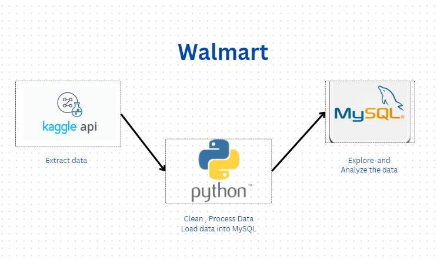

# Walmart_Sales_Analysis

**Project Overview** 

This project is an end-to-end data analysis solution designed to extract critical business insights from Walmart sales data.
I utilize Python for data cleaning ,processing and SQL for analysis and advanced querying, and structured problem-solving techniques to solve key business questions

**Project Steps**

**1. Set Up the Environment**

Tools Used:Python,Jupyter notebook, MySQL workbench

**2.API Setup** 

Obtain your Kaggle API token from Kaggle by navigating to your profile settings and downloading the JSON file.

**Configure Kaggle:**

Place the downloaded kaggle.json file in your local .kaggle folder.
Use the command kaggle datasets download -d <dataset-path> to pull datasets directly into your project.

**3.Load Data**

Loading Data:
Read the data into a Pandas DataFrame for initial analysis and transformations

**4.Explore the Data**

 Use functions like .info(),  and .head() to get a quick overview of the data structure .

**5.Data Cleaning**

1) Remove Duplicates: Identify and remove duplicate entries to avoid skewed results.
   
2) Handle Missing Values: Drop rows or columns with missing values if they are insignificant; fill values where essential.
   
3) Fix Data Types: Ensure all columns have consistent data types (e.g., dates as datetime, prices as float).
   
4) Currency Formatting: Use .replace() to handle and format currency values for analysis.
   
5) Validation: Check for any remaining inconsistencies and verify the cleaned data.

**6.Feature Engineering**

Create New Columns: 
Calculate the Total_sales,Profit and date realted columns.

**7.Load Data into MySQL**

Set Up Connections: Connect to MySQL using Pymysql and load the cleaned data into database.
Table Creation: Create and insert the data into MySQL using pymysql.

**8.SQL Analysis**

Business Problem-Solving: Write and execute complex SQL queries to answer critical business questions, such as:

1)Revenue trends across branches and categories.

2)Identifying best-selling product categories.

3)Sales performance by time, city, and payment method.

4)Analyzing peak sales periods and customer buying patterns.

**9.Requirements**

Python 3

Jupyter notebook

SQL Databases: MySQL

Python Libraries:pandas, numpy,Pymysql

Kaggle API Key (for data downloading)

**10.Insights**

Sales Insights:
Key categories, branches with highest sales, and preferred payment methods.

Profitability: 
Insights into the most profitable product categories and locations.

Customer Behavior:
Trends in ratings, payment preferences, and peak shopping hours.
